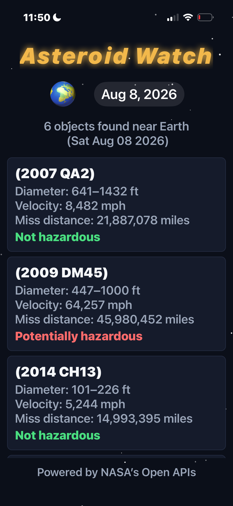
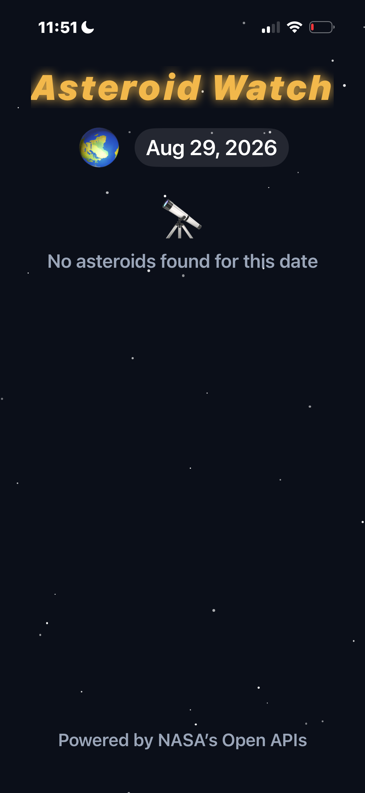
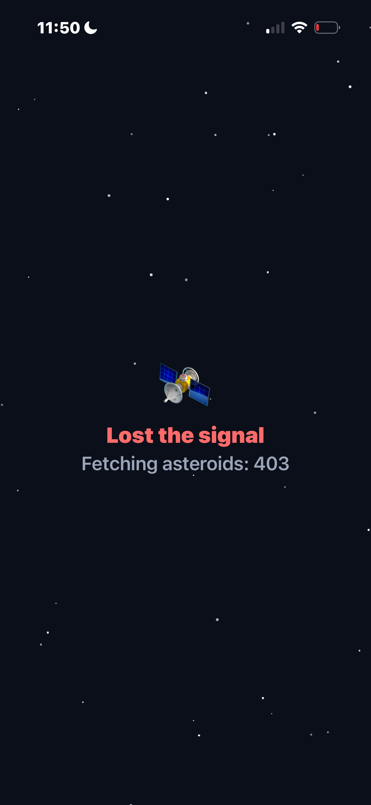

# Asteroid Watch

A React Native (Expo) app that shows near-Earth objects tracked by NASA on any given day. Pick a date, and it fetches that day's feed from NASA's NeoWs API and lists each object's name, diameter range, relative velocity, miss distance, and whether it's flagged as potentially hazardous.

## Screenshots





## Features

- Date picker, defaulting to today
- Fetches NASA's NEO feed for the selected date
- Per-object: name, diameter range (ft), relative velocity (mph), miss distance (mi), hazard flag
- Loading, error, and empty states
- Pull-to-refresh
- Dark, space-themed UI


## Tech stack

Expo SDK 54, React Native 0.81, TypeScript, `@react-native-community/datetimepicker`, `react-native-safe-area-context`.

## Setup

1. Clone the repo and install dependencies:

```
git clone https://github.com/Tedicode/neo-monitor.git
cd neo-monitor
npm install
```


2. Copy `.env.example` to `.env` and add a NASA API key:

```
cp .env.example .env
```
   Then edit `.env` and set `EXPO_PUBLIC_NASA_API_KEY` to either:

- `DEMO_KEY` (works out of the box, no signup — but NASA caps it at 30 requests/hour and 50/day per IP), or
- Your own free key from [api.nasa.gov](https://api.nasa.gov/) (1,000 requests/hour, no daily cap)


3. Start the dev server:

```
npx expo start
```

4. Run it:
  - **On a phone:** install the free **Expo Go** app, then scan the QR code printed in the terminal (phone and computer must be on the same Wi-Fi network)
  - **On a simulator/emulator:** press `i` (iOS) or `a` (Android) in the terminal after `expo start`


## Known limitations

- **Tested only on iOS**, via Expo Go on a physical iPhone — no Android device or emulator was available during development. The Android date-picker implementation follows the pattern documented in the `@react-native-community/datetimepicker` library's own README, but hasn't been physically verified.
- The app shows the OS's default native splash briefly on launch rather than a custom one — deliberately skipped, since Expo's own docs advise against testing a custom splash screen in Expo Go, and Expo Go is the only environment this app has been tested in.

